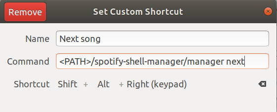
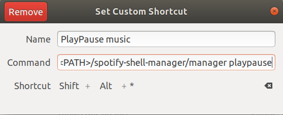
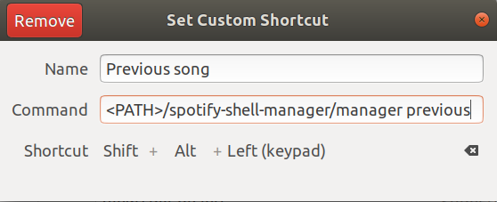

# Create custom keyboard shortcuts

Go to `Settings > Keyboard` or `Settings > Devices > Keyboard` and press the _add new shortcut_ button.

You'll have to fill a form with these values:
- Name: Shortcut name (e.g: `Play/Pause song`)
- Command: Shell command to be run (e.g: `./manager playpause`)
- Shortcut: Keyboard shortcut (e.g: `Ctrl/Cmd + Alt + *`)
> Remember that in command field you should type the absolute path to the `manager` script

## Examples

### Next song shortcut

### Playpause song shortcut

### Previous song shortcut

